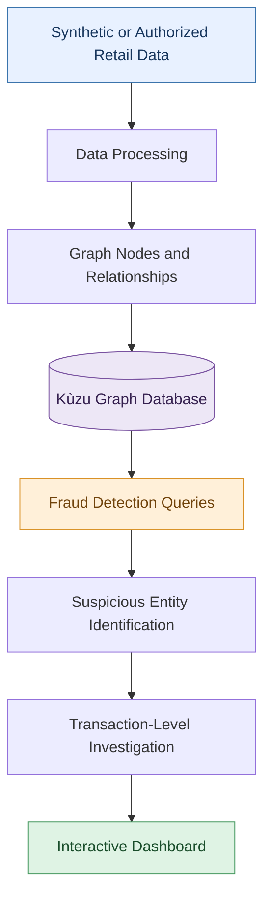

# CTC Retail Fraud Graph

<p align="center">
  <strong>Graph-Powered Retail Fraud Detection & Investigation</strong>
  <br />
  An analytics pipeline for discovering suspicious transaction patterns, shared payment identifiers, and potentially fraudulent retail networks.
</p>

<p align="center">
  
  
  
  
</p>

---

## 📌 Overview

**CTC Retail Fraud Graph** is a graph-based analytics project designed to identify suspicious retail transaction activity by modeling relationships among people, transactions, payment tokens, stores, and products.

Unlike traditional tabular analysis, graph analytics makes it possible to explore connections across multiple entities and uncover patterns that may otherwise remain difficult to detect.

The project uses **[Kùzu](https://kuzudb.com/)**, an embedded graph database, to represent retail activity as a network of connected entities. Custom detection queries analyze these relationships to surface potential fraud indicators and support further investigation.

> **Objective:** Transform connected retail transaction data into actionable fraud investigation leads through graph modeling, anomaly detection, and interactive exploration.

## ✨ Key Features

| Feature                      | Description                                                                                            |
| ---------------------------- | ------------------------------------------------------------------------------------------------------ |
| 🧪 Synthetic Data Generation | Generate simulated retail transactions, entities, and behavioral patterns for development and testing. |
| 🕸️ Graph Data Modeling      | Represent people, transactions, payment tokens, stores, and products as connected graph entities.      |
| 🔎 Pattern-Based Detection   | Identify shared payment tokens, suspicious return activity, and cross-store transaction patterns.      |
| 📊 Risk Investigation        | Aggregate transaction-level evidence to help prioritize suspicious entities and activities.            |
| 🌐 Interactive Dashboard     | Explore graph relationships and detection results through a web-based interface.                       |
| 📍 Location Analysis         | Incorporate store locations and geospatial information into retail analytics.                          |

## 🧠 Detection Approach

The project uses connected transaction data to investigate several potential fraud indicators.

### 1. Shared Payment Token Analysis

Identify payment tokens associated with multiple customer identities. These relationships can highlight shared payment methods or accounts that warrant further investigation.

### 2. Suspicious Return Activity

Analyze return transactions using indicators such as:

* Missing or absent receipt information
* Products categorized as high theft risk
* Activity spanning multiple stores
* Transaction amounts and repeated behavior

### 3. Cross-Store Relationship Analysis

Explore how payment tokens, people, products, and transactions connect across store locations to identify unusual networks of activity.

### 4. Transaction-Level Investigation

Retrieve the underlying transactions and associated entities for a flagged token or pattern, providing context for follow-up analysis.

**Important:** These patterns are investigative signals, not proof of fraud. Findings require validation against business rules and supporting evidence.

## 🏗️ Architecture

The intended workflow follows a data-to-investigation pipeline:



## 🗂️ Project Structure

```text
ctc-retail-fraud-graph/
│
├── dashboard/
│   └── app.py                 # Dashboard application
│
├── data/
│   ├── raw/                   # Raw or generated input data
│   └── processed/             # Cleaned, graph-ready datasets
│
├── notebooks/                 # Exploratory analysis and prototyping
│
├── src/
│   ├── anomaly/               # Fraud detection and anomaly logic
│   └── graph/                 # Graph schema, ingestion, and queries
│
├── kuzu_db                    # Local Kùzu database file (not committed)
├── generate_data.py           # Synthetic data generation
├── location.py                # Location and geospatial utilities
├── test_setup.py              # Environment verification
├── requirements.txt           # Python dependencies
└── .gitignore                 # Git exclusion rules
```

*The structure above describes the intended organization. Update it as the implementation evolves.*

## ⚙️ Tech Stack

| Technology           | Purpose                                                     |
| -------------------- | ----------------------------------------------------------- |
| **Python**           | Core application logic and data processing                  |
| **Kùzu**             | Embedded graph database and relationship queries            |
| **Pandas**           | Data transformation and aggregation                         |
| **Streamlit / Dash** | Potential dashboard frameworks, depending on implementation |
| **Jupyter Notebook** | Exploratory data analysis and prototyping                   |
| **Git & GitHub**     | Version control and project collaboration                   |

## 🚀 Getting Started

### Prerequisites

Ensure the following are installed:

* Python 3.8 or later
* Git
* `pip`, the Python package installer

### 1. Clone the Repository

Replace `<your-username>` with your GitHub username.

```bash
git clone https://github.com/<your-username>/ctc-retail-fraud-graph.git
cd ctc-retail-fraud-graph
```

### 2. Create a Virtual Environment

A virtual environment keeps project dependencies isolated from other Python applications.

**Windows**

```powershell
python -m venv .venv
.venv\Scripts\Activate.ps1
```

If you use Command Prompt instead of PowerShell:

```bat
.venv\Scripts\activate.bat
```

**macOS / Linux**

```bash
python3 -m venv .venv
source .venv/bin/activate
```

### 3. Install Dependencies

```bash
python -m pip install --upgrade pip
pip install -r requirements.txt
```

### 4. Verify the Environment

Run the setup verification script:

```bash
python test_setup.py
```

If the script completes successfully, your configured environment and required dependencies should be ready for the next steps.

## 💻 Usage

### Step 1 — Generate Data

If `generate_data.py` is configured to generate synthetic retail data, run:

```bash
python generate_data.py
```

Review the generated files in `data/raw/` and `data/processed/`, depending on how the script is implemented.

### Step 2 — Build the Graph

Use the graph schema and ingestion scripts in `src/graph/` to load the processed entities and relationships into Kùzu.

The graph model includes entities such as:

* `Person`
* `Transaction`
* `Token`
* `Store`
* `Product`

Relationships connect people to transactions, transactions to payment tokens, and transactions to stores and products.

> The exact database initialization and ingestion command depends on the scripts implemented in `src/graph/`.

### Step 3 — Run Fraud Detection

Execute the graph queries or detection scripts implemented in `src/anomaly/` to investigate shared tokens, suspicious returns, and cross-store activity.

Review the results alongside the underlying transactions before treating any pattern as a potential fraud case.

### Step 4 — Launch the Dashboard

If the application uses Streamlit:

```bash
streamlit run dashboard/app.py
```

If it uses a standard Python entry point instead:

```bash
python dashboard/app.py
```

Use the command appropriate for the actual dashboard framework and entry point.

## 🔐 Data Management & Security

* Do not commit confidential company data, customer information, payment identifiers, or proprietary transaction records.
* Keep virtual environments, local databases, credentials, and sensitive datasets out of version control.
* Use synthetic or explicitly authorized datasets for demonstrations.
* Review `.gitignore` before staging files.
* If using real retail data, follow applicable data governance and access-control requirements.

A recommended `.gitignore` configuration includes:

```gitignore
# Python
__pycache__/
*.py[cod]
*.egg-info/

# Virtual environments
.venv/
venv/

# Environment variables and secrets
.env
.env.*

# Local Kùzu database
kuzu_db
kuzu_db.*

# Generated data — review before committing
data/raw/
data/processed/

# Notebook checkpoints
.ipynb_checkpoints/

# IDE and operating system files
.vscode/
.idea/
.DS_Store
Thumbs.db
```

**Note:** Exclude generated data only if it can be recreated or is intentionally kept outside the repository. If a small, synthetic sample dataset is required for reproducibility, include that sample explicitly instead.

## 🛣️ Roadmap

Potential future enhancements include:

* [ ] Expand graph-based fraud detection patterns.
* [ ] Develop entity-level risk scoring.
* [ ] Improve graph visualization and investigation workflows.
* [ ] Add configurable detection thresholds.
* [ ] Build investigation summaries and evidence trails.
* [ ] Evaluate detection quality using labeled synthetic scenarios.
* [ ] Add automated tests for graph schema, ingestion, and detection queries.

## 🤝 Contributing

Contributions and suggestions are welcome.

1. Fork the repository.
2. Create a feature branch.
3. Make your changes and test them.
4. Submit a pull request describing the change.

## ⚖️ Disclaimer

This project is intended for educational, analytical, and demonstration purposes. Detection results are indicators for further investigation and should not be treated as definitive findings of fraud.

---

<p align="center">
  <strong>CTC Retail Fraud Graph</strong>
  <br />
  Graph Analytics · Anomaly Detection · Retail Investigation
</p>
